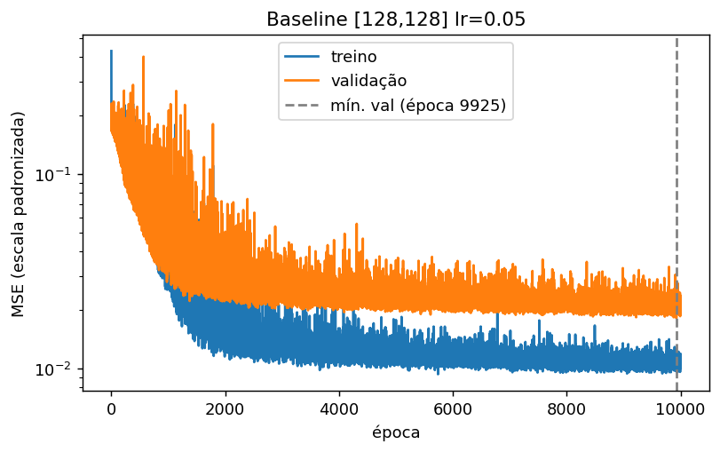
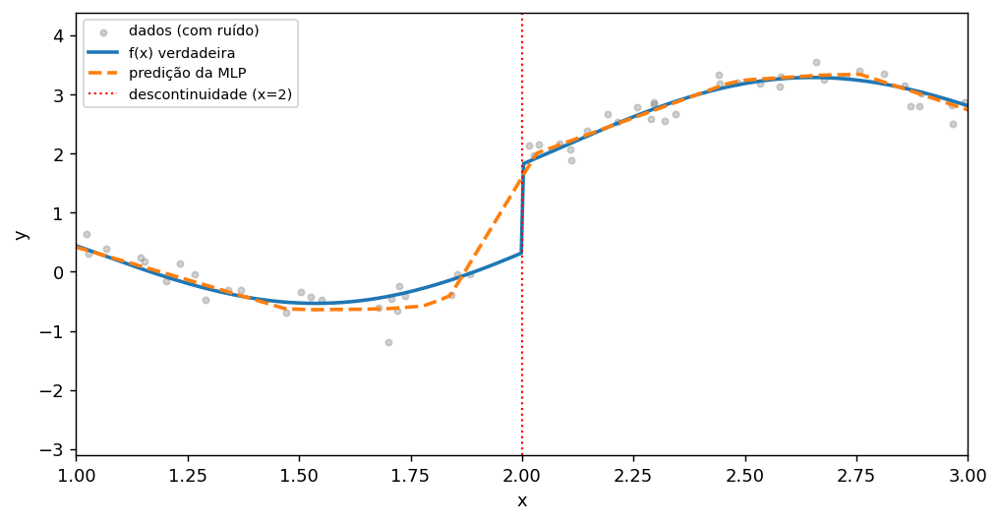
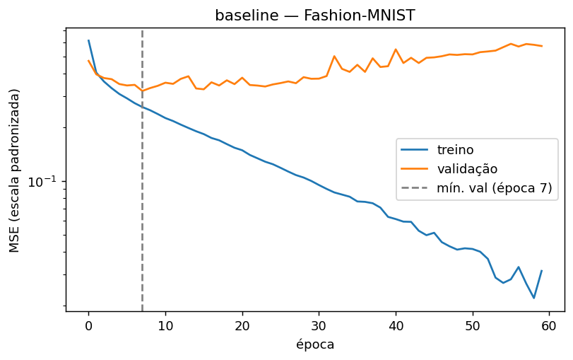
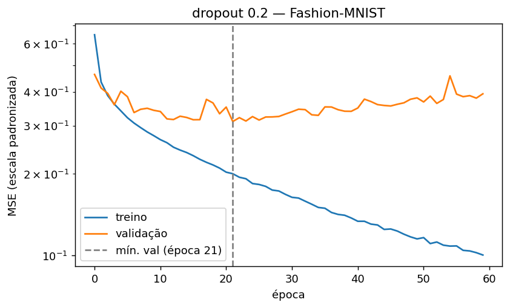
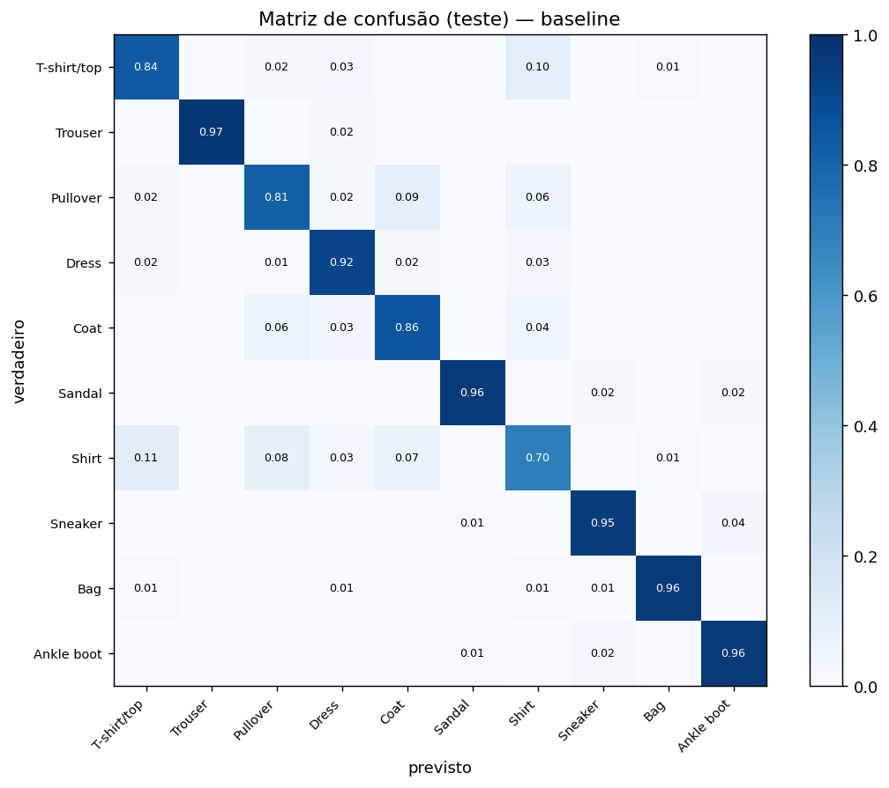

# Redes Neurais MLP

Projeto 1 da disciplina de Redes Neurais. Constrói um modelo MLP de referência
(*baseline*) para dois problemas de naturezas distintas,  **regressão** sobre uma função
sintética e **classificação** no Fashion-MNIST e mede o efeito de quatro componentes
adicionados isoladamente: **L1**, **L2**, **dropout** e **momentum**.

**[Relatório completo em PDF](relatorio.pdf)**

---

## Resultado principal

> Os mesmos quatro componentes, no mesmo motor de treino e sob o mesmo protocolo,
> produziram **conclusões opostas** nos dois problemas.

| | Regressão | Classificação |
|---|---|---|
| Razão erro treino/validação | 1,9× | **18,2×** |
| L1 / L2 / dropout | degradam **monotonicamente**, ótimo em zero | os três com melhor valor **positivo** |
| Melhor componente | nenhum (momentum 0,5 dentro do ruído) | dropout 0,2 |

A diferença é explicada pela **quantidade de sobreajuste disponível para ser combatida**.
Na regressão não havia variância excessiva a remover, e a penalização só introduziu viés.

Metodologia: todas as decisões tomadas em validação, conjunto de teste acessado uma única
vez por modelo, **3 sementes** por configuração com média ± desvio, e orçamento de épocas
fixo (sem *early stopping*, que é regularização e contaminaria o baseline).

---

## Problema 1: Regressão

`f(x) = sin(3x) + 0.3x + 1.5·1[x>2] + ε`, com `ε ~ N(0, 0.2²)`, `x ~ U(-5,5)`, n = 300.

**Baseline:** `[128,128]`, lr 0,05, 10.000 épocas &nbsp;·&nbsp; **Teste:** R² = 0,9829 ± 0,0018
(teto teórico imposto pelo ruído: **0,987**)

| | |
|---|---|
|  |  |

À direita, o limite representacional: onde `f(x)` tem um **salto vertical** em x=2, a rede
produz uma rampa de largura ~0,17. Uma MLP é composição de funções contínuas e não *pode*
representar uma descontinuidade, só aproximá-la. Mais capacidade estreita a rampa, nunca
a elimina.

---

## Problema 2: Classificação (Fashion-MNIST)

50.000 treino / 10.000 validação / 10.000 teste (oficial), imagens 28×28 → 784 entradas.

**Baseline:** `[256,256]`, lr 0,1, 60 épocas &nbsp;·&nbsp; **Teste:** acurácia = 0,8895 ± 0,0044
&nbsp;·&nbsp; **com dropout 0,2:** 0,8948 ± 0,0022

| baseline | com dropout 0,2 |
|---|---|
|  |  |

O dropout corta a razão treino/validação de **18,2× para 3,9×** e adia o pico da validação
da época 7 para a 21 — mas a acurácia sobe apenas 0,3 p.p. Em classificação, o sobreajuste
aparece **primeiro na perda e só depois na acurácia**, porque a entropia cruzada pune
confiança alta no erro.



Os erros formam um **bloco semântico**: *Shirt* (recall 0,698), *Pullover*, *T-shirt/top* e
*Coat* confundem-se entre si, enquanto calçados e bolsa passam de 95%. Todas as classes
problemáticas são peças de tronco superior, que se distinguem por detalhes **locais**
(gola, botões, punho). Como `.view(-1, 784)` destrói a noção de vizinhança entre pixels, a
MLP não tem como representá-los: **o limite aqui não é de sobreajuste, é de representação** —
e é exatamente o que uma CNN atacaria.

---

## Reprodução

```bash
pip install torch torchvision scikit-learn matplotlib numpy
python3 baseline.py         # busca do baseline da regressão      (~13 min)
python3 ablacoes.py         # 4 ablações da regressão             (~30 min)
python3 final.py            # teste + gráficos da regressão       (~10 min)
python3 baseline_mnist.py   # busca do baseline do Fashion-MNIST  (~7 min)
python3 ablacoes_mnist.py   # 4 ablações da classificação         (~20 min)
python3 final_mnist.py      # teste + matriz de confusão          (~10 min)
```

O dataset do Fashion-MNIST é baixado automaticamente na primeira execução (não versionado).
As sementes são fixas: os números são reproduzíveis exatamente.

## Estrutura

| arquivo | conteúdo |
|---|---|
| `setup.py` | motor compartilhado: geração dos dados, MLP, laço de treino, métricas |
| `mnist.py` | dados e métricas do Fashion-MNIST, reutilizando o mesmo motor |
| `baseline.py` / `baseline_mnist.py` | busca coordenada de arquitetura e taxa de aprendizado |
| `ablacoes.py` / `ablacoes_mnist.py` | as quatro variantes, arquitetura congelada |
| `final.py` / `final_mnist.py` | avaliação no teste, curvas e matriz de confusão |
| `graficos.py` | ajuste da regressão sobre f(x) |
| `*.json` | todos os números brutos de cada etapa |
